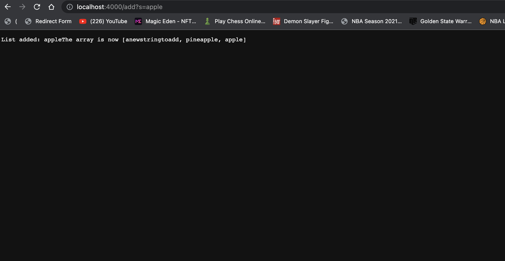

# Edwin's Lab Report 2

# Part 1
Code for the searching Engine:
```
import java.io.IOException;
import java.net.URI;
import java.util.ArrayList;

class Handler implements URLHandler {
    // The one bit of state on the server: a number that will be manipulated by
    // various requests.
    int num = 0;
    ArrayList<String> string = new ArrayList<String>();
    ArrayList<String> result = new ArrayList<String>();

    public String handleRequest(URI url) {
        if (url.getPath().equals("/")) 
        {
            return String.format("String array: "+ string); 
        } else if (url.getPath().contains("/add")) 
        {
            String[] Par = url.getQuery().split("=");
            if(Par[0].equals("s"))
            {
                string.add(Par[1]);
                return String.format("List added: "+Par[1]+"The array is now "+ string);
            }
        return "Error";  
    } else 
    {
            System.out.println("Path: " + url.getPath());
            if (url.getPath().contains("/search")) {
                String[] Par = url.getQuery().split("=");
                if (Par[0].equals("s")) {
                    for(int i=0;i<string.size();i++)
                    {
                        if(string.get(i).indexOf(Par[1])!=-1)
                        {
                            result.add(string.get(i));
                        }
                    }
                    return String.format("The search result of searching which words have "+ Par[1]+" are "+ result);
                }
            }
            return "Error";
        }
    }
}

public class SearchEngine {
    public static void main(String[] args) throws IOException {
        if(args.length == 0){
            System.out.println("Missing port number! Try any number between 1024 to 49151");
            return;
        }

        int port = Integer.parseInt(args[0]);

        Server.start(port, new Handler());
    }
}
```
When entering javac Server.java ... remember to change NumberServer.java to SearchEngine.java! Don't make the same mistake like I did.

First move:
The equals("/") get called, since in the URL there is no more words after /. It also shows the empty array, becasue the "add" haven't be called yet.


The "add" get called and also add the word "anewstringtoadd" into the array.


The "add" get called and also add the word "pineappele" into the array.


The "add" get called and also add the word "apple" into the array.



The "search" get called, it searchs which words contain "app" and show us.
As we can see, both pineapple and aplle contain "app".


# Part 2
# First: Bug in ArrayExample.java (The reversed function):

This is the input I run for reversed function:


The symptoms and errors got from running with Junit:
We can see all three inputs failed, and we can see the array always contain zero, and it is different from what we should expect.

First input result:


Second input result:


Third input result:


In the image below, we fixed the bug of the reversed function, we correctly assign the numbers to the newArray not the old array and change "return arr" to "return newArray". 


After fixing the bugs, all three tests success.


Conclusion for bug fixing on reversed function, connection between the symptom and the bug: The issue in the function reversed is in the original (no fix) reversed method, it returns the old array(arr), instead of the new array  (newArray). Also, inside the loop, we can see it actually store the value of new array into the old array, which new array is always set to 0. That's the reason why the output are always 0 and didn't meet the expection.

# Second: Bug in ListExample.java (The merge function):

This is the input I tested for the merged function in ListExample.java.
 

The symptoms and errors got from running with Junit:
We can see all two inputs failed, and Junit show that the symtom is "java.;ang.OutOfMemoryError: Java heap space"
 

In the image below, we fixed the bug of the merge function and it is a simple bug fixed, we change "index+=1" to "index2+=1" in line 44 with the red circle! 
 

 After fixing the bug, we run it with Junit again and get success for both tested input.
 

 Conclusion for bug fixing on merge function, connection between the symptom and the bug: The bug of the function is on line 44, in the original (not fix) merge function, it was index1+=1, which should change to index2+=1, because it should add list2 into the new array not list1. As a result, it casues java.;ang.OutOfMemoryError: Java heap space as a symptom.  


